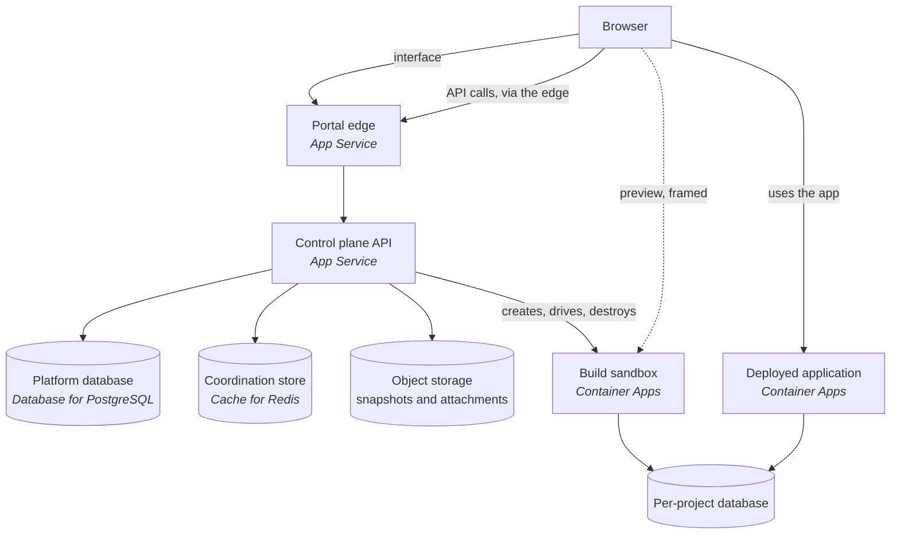
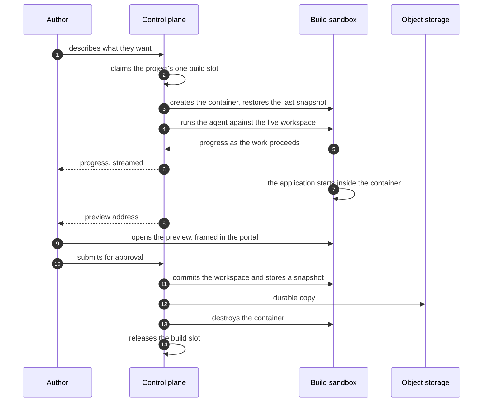
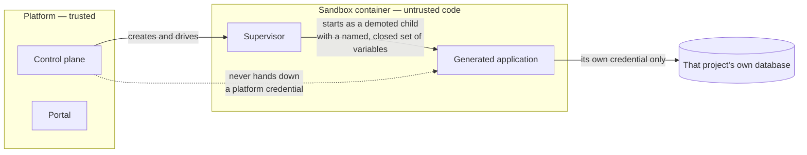

# Architecture

How the platform is put together, and why it is put together that way. This document explains
shape and reasoning. It deliberately carries no resource names, no configuration values and no
version numbers — those live in the files that own them, and a document that restated them would
be wrong within a release.

## What this is

An internal platform on which non-developers build working web applications by describing what
they want. Someone writes a few sentences, an AI agent builds the application, and they see it
running within the same page a few moments later. They iterate by continuing the conversation.
When they are satisfied, they submit the application for approval, and an approved application is
deployed for their colleagues to use.

Two properties shape almost every decision below.

**The code is written by a model, not reviewed by a person.** Every application the platform
produces is generated. Nobody reads it line by line before it runs. So the platform never trusts
it: it executes in a container that can be thrown away, it is handed no credential it could leak,
and the blast radius of anything it does is bounded by construction rather than by review.

**The people using it are not developers.** They cannot be asked to diagnose a failure, retry a
stuck operation, or know that something needs cleaning up. Work that a developer tool would leave
to the user — recovering a session, reclaiming abandoned resources, deciding whether a build
actually succeeded — the platform has to do on its own.

## The four deployable units

| Unit | What it does | Where it runs |
|---|---|---|
| **Control plane** | The HTTP API. Authentication, projects and conversations, quota, the approval workflow, and the orchestration of everything below. | App Service for Containers |
| **Portal** | The single-page application people actually use, served by a small web edge that also forwards API calls to the control plane. | App Service for Containers |
| **Build sandbox** | One disposable container per project, holding a live workspace and running the generated application so its author can see it. | Container Apps |
| **Deployed application** | An approved application, built from a durable snapshot and published for its audience. | Container Apps |

The control plane serves the API and nothing else — it holds no user interface and runs no
JavaScript runtime. The portal edge serves the built interface and forwards API traffic; it runs
no JavaScript runtime either, because the interface is compiled to static files ahead of time.
Keeping the two apart means the interface can be rebuilt and redeployed without touching the API,
and that the API's container carries no toolchain it does not use at runtime.

The build sandbox is not deployed by an operator. The control plane creates one when someone
starts work and deletes it when they are done; an operator only ever builds and publishes the
image it is created from.

Two edges in that picture matter more than they look. The browser reaches a running preview
**directly**, not proxied through the control plane — the preview is framed from its own origin.
And a generated application reaches its data **directly**, not through the control plane at all.
Both are explained below.

## How a build flows

**A build is a turn.** One project builds one thing at a time. The slot is claimed before any
container work starts and released after everything is finished, so a second request for the same
project either joins the work in progress or is told to wait — it can never start a competing
build against the same workspace.

**The live workspace is the truth while the work is happening.** The container holds the real
files; there is no parallel copy in the database that could disagree with it. That is why closing
the page and coming back reattaches to the same work rather than starting again.

**The order of the last three steps is load-bearing.** The snapshot is stored durably, *then* the
container is destroyed, *then* the slot is released — always in that order. Releasing the slot
first would let the next build start before the previous workspace was safely stored, and it would
restore from a snapshot that was either stale or absent. The slot is what makes storing and
destroying look atomic to the person waiting.

## Trust boundaries

The generated application is the untrusted party. Everything here follows from that.

**Generated code runs as a demoted child of a supervisor, in an environment built as an
allowlist.** The child's environment starts empty and only named, approved values are copied in.
It is built that way round deliberately: a denylist fails open, so anything added to the platform
later would reach the generated application by default until somebody remembered to exclude it. An
allowlist fails closed, which is the correct direction when the thing on the other side is code
nobody has read.

**The browser never holds a credential for data.** What reaches the page is an application
identity and the address of the portal it is framed in — enough to know which application it is,
useless for reaching anything. The credential that opens the data lives in the container, server
side, and never travels to the browser.

**A preview is framed cross-origin, and the framing rules are the protection.** The preview is
served from its own origin and displayed inside the portal. The sandbox permits exactly one parent
origin to frame it, the portal permits exactly that preview to be framed, and both directions of
message passing name the other origin explicitly rather than accepting anyone.

It is worth being precise about what this does and does not protect, because the mechanism is
easy to over-read: **these rules govern framing, not what the generated application may fetch.**
They stop the preview being framed by a hostile page and stop a hostile page being framed as a
preview. They are not a content policy over the application's own network access, and they were
never intended to be — the boundary that constrains what generated code can reach is the
environment allowlist and the per-project credential, not the framing headers.

The control plane is also unreachable on the generated application's own origin. Nothing on the
path that serves applications forwards to the API, so an application cannot call the platform's
own endpoints by convenience of being nearby.

## Generated-app data isolation

**Each project owns a database.** Not a shared database with a project column — an actual separate
database with its own credential.

The reason is what "isolation" has to mean when the code is generated. A shared table isolated by a
column is isolated by *every query being written correctly*. One query missing its predicate is a
cross-project leak. That is a reasonable bet when every query is written and reviewed by people;
it is not a reasonable bet when queries are written by a model, at volume, and nobody reads them.
A separate database moves the guarantee from the correctness of the code into the shape of the
system: the credential a project holds opens exactly one database, and a query that forgets a
condition returns that project's own rows and no one else's.

Two details make that guarantee real rather than nominal:

- **Connection is revoked by default and granted deliberately.** Provisioning removes the
  general right to connect before granting it to the one role that should have it. Without that
  step the database is nominally separate and practically open to any role the server already
  knows.
- **The project's role is made the owner of its schema.** On a managed PostgreSQL service the
  default schema is owned by a service-managed administrative role rather than by whoever owns the
  database, so an application that simply creates tables may find it cannot. Provisioning
  explicitly deeds schema ownership to the project's own role, which is what makes the database
  usable by its owner rather than merely allocated to it.

Retiring a project reverses this deliberately too: the role is stopped from logging in and its
right to connect is removed *before* existing connections are closed, so a connection cannot be
re-established in the gap between closing it and revoking the right to open it.

**Database access uses passwords, not directory identities.** This is a considered exception
rather than an oversight. Per-project directory authentication would mean one directory principal
for every project, created and mapped by a human with directory-write authority, on the critical
path of an operation the platform performs automatically many times a day. The platform holds no
such authority, and asking for it would put a person in the middle of an automated flow. Instead,
each project's credential is randomly generated, stored encrypted, and confined to one database.

**A deployed application reaches its database directly.** It does not route data access through
the control plane. This keeps the control plane off the data path entirely: it cannot become the
bottleneck for every application's traffic, and it holds no ambient authority over application
data that a confused-deputy bug could be tricked into exercising.

## How state is held

Three stores, with distinct jobs, and the distinction matters:

- **The platform database** is the record: people, projects, conversations, applications, approval
  state, audit. Anything that must survive is here.
- **Object storage** holds the large immutable things — workspace snapshots and uploaded files —
  behind a single interface the rest of the code uses. The platform talks to that interface rather
  than to a specific vendor's client, which is what keeps the storage decision a decision rather
  than a dependency threaded through every call site.
- **The coordination store** holds what is true only right now: which build holds which slot,
  what a live session is doing, scheduling for background work. It is deliberately not treated as
  a record of anything. Everything in it can be lost without losing a fact the platform needs.

## Fleet reclamation

Sandboxes are created constantly and are meant to be thrown away. Something has to throw them
away, because the people creating them cannot be asked to.

**The cloud provider is the authority on what exists.** Not the coordination store, not the
database. The principle is simple: the inventory that matters is the one being billed. A
coordination store is a *spare list* — a useful hint about what the platform believes it started —
and treating a hint as an inventory means the platform confidently deletes records for containers
that are still running, and leaves running containers nothing is tracking. So reclamation asks the
provider what exists and treats that answer as the truth.

**Destruction waits for signals that agree.** Deleting a container that somebody is still using is
the expensive mistake, and the cheap mistake — waiting longer — costs only money. So the pass
reads several independent signals and destroys only what several of them concur on, waiting longer
where the consequence of being wrong is higher. A container that clearly nothing has claimed goes
sooner than one that might still belong to someone.

**Nothing is destroyed until a durable copy exists.** The snapshot precedes the delete, always.
This is the same ordering the build flow follows, for the same reason.

**A pass records that it ran, whatever the outcome.** Including when it decided to do nothing. A
job that only writes a record when it acts is indistinguishable, from the outside, from a job that
has stopped running — and the failure that actually happens is the scheduled work quietly dying,
not the work doing the wrong thing. The absence of a pass record is the only honest detector of
that.

## Where to go next

- `deployment.md` — the services the platform needs, how an image reaches runtime, and how to
  prove a deployment worked.
- `adr/` — the decisions in force, each with the reasoning that produced it.
- `runbooks/` — what to do when something needs operating or recovering.
- `reference/` — the API surface and the permissions the platform requires of its host.
