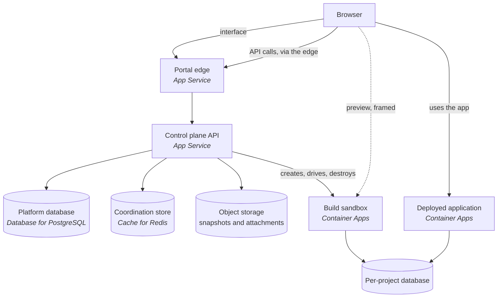
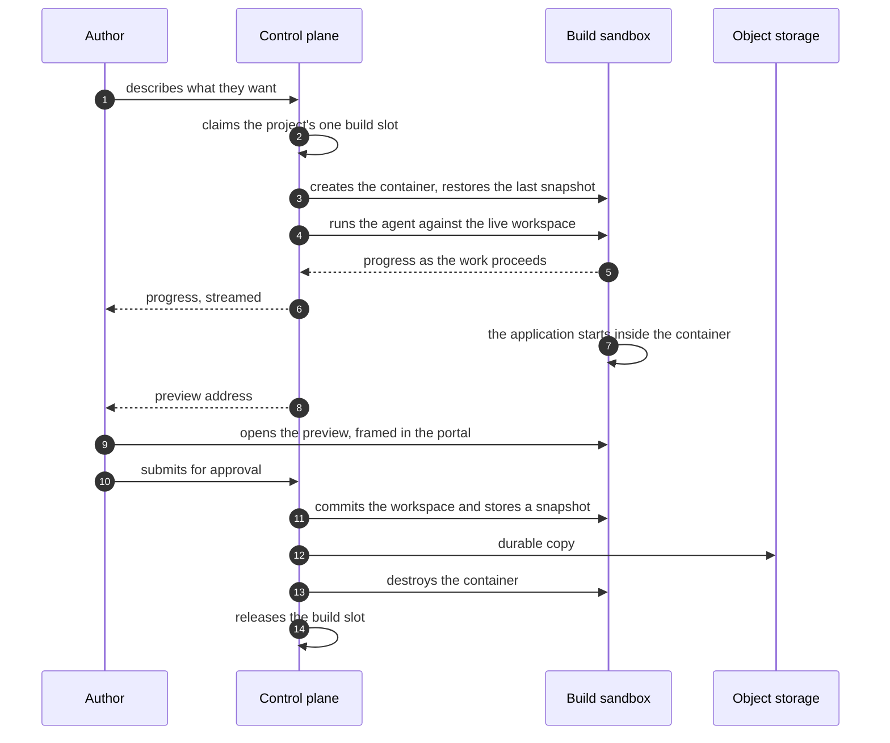
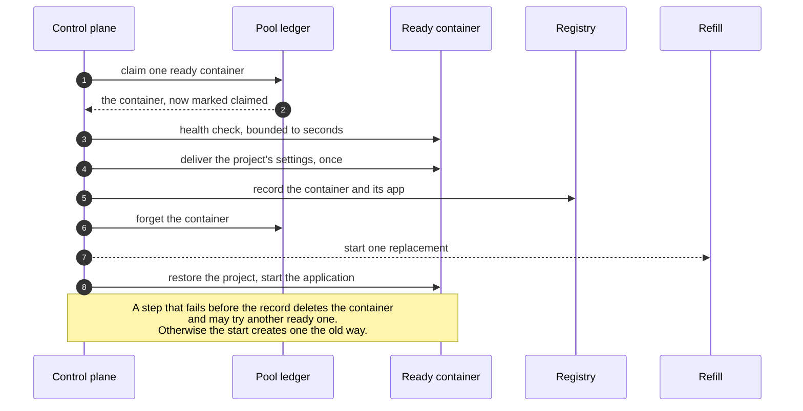
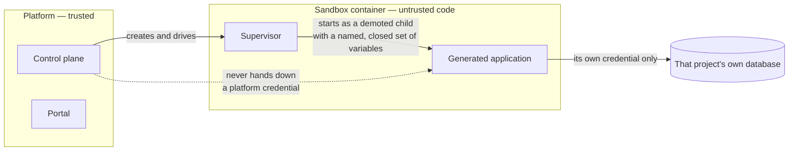

# Architecture

How the platform is put together, and why it is put together that way. This document explains
shape and reasoning. It deliberately carries no resource names, no configuration values and no
version numbers — those live in the files that own them, and a document that restated them would
be wrong within a release.

## What this is

An internal platform on which non-developers build working web applications by describing what
they want. Someone writes a few sentences, an AI agent builds the application, and they see it
running within the same page a few moments later. They iterate by continuing the conversation.
When they are satisfied, they submit the application for approval, and an approved application is
deployed for their colleagues to use.

Two properties shape almost every decision below.

**The code is written by a model, not reviewed by a person.** Every application the platform
produces is generated. Nobody reads it line by line before it runs. So the platform never trusts
it: it executes in a container that can be thrown away, it is handed no credential it could leak,
and the blast radius of anything it does is bounded by construction rather than by review.

**The people using it are not developers.** They cannot be asked to diagnose a failure, retry a
stuck operation, or know that something needs cleaning up. Work that a developer tool would leave
to the user — recovering a session, reclaiming abandoned resources, deciding whether a build
actually succeeded — the platform has to do on its own.

## The deployable units

| Unit | What it does | Where it runs |
|---|---|---|
| **Control plane** | The HTTP API. Authentication, projects and conversations, quota, the approval workflow, and the orchestration of everything below. | App Service for Containers |
| **Portal** | The single-page application people actually use, served by a small web edge that also forwards API calls to the control plane. | App Service for Containers |
| **Background worker** | The scheduled passes nobody triggers: reconciling deployments, sweeping and reclaiming idle sandboxes, keeping the pool of ready sandboxes at its size, deleting old sandbox start timings, removing conversations nobody has come back to. Same image as the control plane, started with a different command and no inbound traffic. | Container Apps |
| **Build sandbox** | One disposable container per project, holding a live workspace and running the generated application so its author can see it. Made when someone starts work, or taken from a pool of ready ones made ahead. | Container Apps |
| **Deployed application** | An approved application, built from a durable snapshot and published for its audience. | Container Apps |

The worker shares the control plane's image deliberately — the task definitions have to be
importable by whichever process runs them, and one image means the two can never be built from
different code. What separates them is the start command and the absence of an ingress.

The control plane serves the API and nothing else — it holds no user interface and runs no
JavaScript runtime. The portal edge serves the built interface and forwards API traffic; it runs
no JavaScript runtime either, because the interface is compiled to static files ahead of time.
Keeping the two apart means the interface can be rebuilt and redeployed without touching the API,
and that the API's container carries no toolchain it does not use at runtime.

The build sandbox is not deployed by an operator. The control plane creates one — or takes a ready
one made ahead of time — when someone starts work and deletes it when they are done; an operator
only ever builds and publishes the image it is created from.

```mermaid
flowchart TD
  B["Browser"]
  P["Portal edge<br/><i>App Service</i>"]
  A["Control plane API<br/><i>App Service</i>"]
  DB[("Platform database<br/><i>Database for PostgreSQL</i>")]
  R[("Coordination store<br/><i>Cache for Redis</i>")]
  O[("Object storage<br/>snapshots and attachments")]
  S["Build sandbox<br/><i>Container Apps</i>"]
  D["Deployed application<br/><i>Container Apps</i>"]
  AD[("Per-project database")]

  B -->|"interface"| P
  B -->|"API calls, via the edge"| P
  P --> A
  A --> DB
  A --> R
  A --> O
  A -->|"creates, drives, destroys"| S
  B -.->|"preview, framed"| S
  B -->|"uses the app"| D
  S --> AD
  D --> AD
```

Two edges in that picture matter more than they look. The browser reaches a running preview
**directly**, not proxied through the control plane — the preview is framed from its own origin.
And a generated application reaches its data **directly**, not through the control plane at all.
Both are explained below.

## How a build flows

```mermaid
sequenceDiagram
    autonumber
    participant U as Author
    participant A as Control plane
    participant S as Build sandbox
    participant O as Object storage

    U->>A: describes what they want
    A->>A: claims the project's one build slot
    A->>S: creates the container, restores the last snapshot
    A->>S: runs the agent against the live workspace
    S-->>A: progress as the work proceeds
    A-->>U: progress, streamed
    S->>S: the application starts inside the container
    A-->>U: preview address
    U->>S: opens the preview, framed in the portal
    U->>A: submits for approval
    A->>S: commits the workspace and stores a snapshot
    A->>O: durable copy
    A->>S: destroys the container
    A->>A: releases the build slot
```

**A build is a turn.** One project builds one thing at a time. The slot is claimed before any
container work starts and released after everything is finished, so a second request for the same
project either joins the work in progress or is told to wait — it can never start a competing
build against the same workspace.

**The live workspace is the truth while the work is happening.** The container holds the real
files; there is no parallel copy in the database that could disagree with it. That is why closing
the page and coming back reattaches to the same work rather than starting again.

**The order of the last three steps is load-bearing.** The snapshot is stored durably, *then* the
container is destroyed, *then* the slot is released — always in that order. Releasing the slot
first would let the next build start before the previous workspace was safely stored, and it would
restore from a snapshot that was either stale or absent. The slot is what makes storing and
destroying look atomic to the person waiting.

## Ready containers

Creating a container is the slowest step of a start, and it is the cloud provider's, not the
platform's. So the platform makes some containers ahead of time and hands one to whoever starts
next. The shape of that follows from what a sandbox is.

**A ready container knows nothing about any project.** Generated code is untrusted, so a container
made before anyone has asked for it holds nothing that could be turned against anyone: no
project's identity, no storage key, no database address, no data identity. Those arrive after a
start claims the container, over the authenticated channel the control plane already uses to drive
every sandbox, once, into the supervisor's own environment — where the allowlist and the redaction
that already guard every sandbox cover them with no second code path. Until they have arrived the
container refuses to start the application.

**A ready container is used once.** Code has run in it. When its project leaves it is saved and
deleted like any other sandbox and never returned to the pool, because reuse could carry one
project's files and processes into the next.

**Every start goes through the one place that creates a container.** A claim there covers every
kind of start, and when nothing ready can be claimed that same place creates a container the old
way. The pool can make a start faster; it cannot make one fail.

**A container's name is not its app's name.** A container made ahead has no app to be named
after, so every lookup reads a record of which app a container serves instead of working the name
out, and names are random and never reused. A delete by name can then only remove what it was meant
for, which is also what lets the previous occupant of a slot be deleted in the background instead
of making the next start wait for it.

```mermaid
sequenceDiagram
    autonumber
    participant S as Control plane
    participant L as Pool ledger
    participant C as Ready container
    participant R as Registry
    participant F as Refill

    S->>L: claim one ready container
    L-->>S: the container, now marked claimed
    S->>C: health check, bounded to seconds
    S->>C: deliver the project's settings, once
    S->>R: record the container and its app
    S->>L: forget the container
    S-->>F: start one replacement
    S->>C: restore the project, start the application
    Note over S,C: A step that fails before the record deletes the container<br/>and may try another ready one.<br/>Otherwise the start creates one the old way.
```

**Two records, with different jobs.** The registry, held in the coordination store, says which
container each person holds and which application it belongs to: it is what the platform knows
about a live container. The ledger, held in the platform database, lists pool containers from the
moment they begin to be made until their claim completes, and a container a start creates for
itself until the registry records it, since a create outlives a cancelled start and nothing else
would name it. Its job is to make the hand-over exclusive: a claim is a single compare-and-set on
one row, so two people starting at once are never given the same container, even through a deploy,
when two instances of the control plane briefly run side by side. When the claim has written the
registry the ledger forgets the container, and from then on the registry describes it like any
other. The ledger lives in the database because it is the thing that must be neither lost nor spent
twice, and the coordination store, which can lose what it holds, is the wrong place for that.

**The count is held at two speeds.** The process that took a container starts its replacement at
once, because nobody should wait for a periodic pass. The worker's periodic pass restores the
count after everything else — a crash, a refused create, the end of the working day, a new sandbox
image — and replaces ready containers on an old image with new ones before it removes the old.
It acts only on containers the ledger holds. A container the ledger does not hold may be somebody's
workspace waiting to be saved, and destroying on a guess is what the rules below forbid.

**Pool work leaves room for people.** Pool creates share each process's limited capacity to talk
to the cloud provider with starts someone is waiting on, so pool work is bounded per process, and a
refused create stops that pass rather than pressing on. The size follows working hours, because a
ready container costs money while it waits. Sizes and hours are settings, owned by
`backend/src/services/sandbox/config.py`; the bound is fixed in the code.

## Publishing

Asking to publish does not publish. The request names the version the author reviewed, and the gate
decides about exactly that version: the saved one. A request about any other version is refused, so
a save that lands after the author looked cannot slip into production under their answers. It
produces one of three outcomes: refuse, publish, or route the application into an administrator's
queue. A request that is routed publishes nothing and leaves the application queued at exactly the
version that was examined.

**What the gate decides with is configured by administrators, not written into the code.** A
reviewer agent reads the saved version and answers Yes or No for each active data class. A class is
either a hard block, where a Yes always routes, or scored, where a Yes adds the class's weight to a
score that is compared with a threshold. Whether the author may correct the reviewer's answers for
scored classes is itself a setting; hard blocks are always the reviewer's. A review counts only for
the saved version and for the class definitions it read: adding, rewording
or switching off a class means the next attempt is reviewed again, while a change to a weight, a
kind or the threshold applies from the next request without one. An application routes when a hard
block is answered Yes, when there is no finished review, when an administrator's rejection stands,
or when the score is over the threshold, and a route requires a note from the author. Every
decision, publish or route, is recorded with the configuration it was made under.

Saving happens before the review, never at send time. Opening the publish dialog saves any unsaved
work first, the review runs on that saved version, and the dialog asks about that version and no
other. Edits made afterwards are newer work, not part of what is being sent.

**An approval is pinned to a commit, not to an application.** Routing keeps an immutable copy of the
version examined, and approving publishes that copy — as its author, whatever they have saved since.
Work continued afterwards is unapproved until it is submitted and cleared in its own right, which is
what stops an approval becoming a standing permission to ship anything later. When publishing cannot
start at the moment of approval, the approval still stands. Where the platform failed, the author's
one action republishes the approved copy without a second review, a bounded number of times. Where
the copy itself failed, a retry would fail the same way, so that action sends the author's saved
version instead, and a fix can go out; it does the same once those attempts run out.

A deploy takes minutes, far longer than an HTTP request may wait, so the request returns as soon as
the work is accepted and the interface polls for the result.

Approval is the only way a reviewed application goes live: nothing records an application as live
by hand.

**Deployed applications carry no authentication of their own.** Anyone who can reach the address of
a deployed application can open it. Whether that address is reachable beyond the corporate network
depends on how the container environment's networking is configured, which is a deployment-time
property rather than something the platform asserts. This is a known gap rather than a design
conclusion, and it is the thing to check first when deciding what an application may hold.

## Trust boundaries

The generated application is the untrusted party. Everything here follows from that.

```mermaid
flowchart LR
  subgraph trusted["Platform — trusted"]
    A["Control plane"]
    P["Portal"]
  end
  subgraph sandbox["Sandbox container — untrusted code"]
    SUP["Supervisor"]
    APP["Generated application"]
  end
  AD[("That project's own database")]

  A -->|"creates and drives"| SUP
  SUP -->|"starts as a demoted child<br/>with a named, closed set of variables"| APP
  APP -->|"its own credential only"| AD
  A -.->|"never hands down<br/>a platform credential"| APP
```

**Generated code runs as a demoted child of a supervisor, in an environment built as an
allowlist.** The child's environment starts empty and only named, approved values are copied in.
It is built that way round deliberately: a denylist fails open, so anything added to the platform
later would reach the generated application by default until somebody remembered to exclude it. An
allowlist fails closed, which is the correct direction when the thing on the other side is code
nobody has read.

**The browser never holds a credential for data.** What reaches the page is an application
identity and the address of the portal it is framed in — enough to know which application it is,
useless for reaching anything. The credential that opens the data lives in the container, server
side, and never travels to the browser.

**A preview is framed cross-origin, and the framing rules are the protection.** The preview is
served from its own origin and displayed inside the portal. The sandbox permits exactly one parent
origin to frame it, the portal permits exactly that preview to be framed, and both directions of
message passing name the other origin explicitly rather than accepting anyone.

It is worth being precise about what this does and does not protect, because the mechanism is
easy to over-read: **these rules govern framing, not what the generated application may fetch.**
They stop the preview being framed by a hostile page and stop a hostile page being framed as a
preview. They are not a content policy over the application's own network access, and they were
never intended to be — the boundary that constrains what generated code can reach is the
environment allowlist and the per-project credential, not the framing headers.

The control plane is also unreachable on the generated application's own origin. Nothing on the
path that serves applications forwards to the API, so an application cannot call the platform's
own endpoints by convenience of being nearby.

**The edge sends a page's security headers once, and a preview's development surface not at
all.** The portal edge owns the browser-facing security headers: what the control plane sets
behind it is replaced rather than repeated. The interface's own document carries a full content
policy; everything else keeps the framing rules alone, because the sign-in page brings a stricter
policy of its own and a browser enforces both together. A preview runs a development server, so
the applications edge refuses the framework's source maps and its development endpoints before
they reach one.

**A generated application cannot spend the person's request budget.** Every signed-in person has a
ceiling on how many API requests they can make over a short window. Requests the browser marks as
coming from an application's page count apart from the portal's own, so an application someone
merely opens cannot lock them out of the portal; signing in and out, and the portal asking who is
signed in, are never refused by it.

**The control plane reads the organisation's directory, and only as its own identity.** Sharing
looks people up there, so an owner can share with a colleague who has never signed in. The call
uses the control plane's own identity, never the one generated applications receive, and it only
reads. Only an owner the directory holds as one of the organisation's own members is offered
people from it; a guest, or anyone whose membership cannot be confirmed, shares with the
platform's own users alone. If the directory cannot be reached, sharing falls back to the
platform's own users.

## Generated-app data isolation

**Each project owns a database.** Not a shared database with a project column — an actual separate
database with its own credential.

The reason is what "isolation" has to mean when the code is generated. A shared table isolated by a
column is isolated by *every query being written correctly*. One query missing its predicate is a
cross-project leak. That is a reasonable bet when every query is written and reviewed by people;
it is not a reasonable bet when queries are written by a model, at volume, and nobody reads them.
A separate database moves the guarantee from the correctness of the code into the shape of the
system: the credential a project holds opens exactly one database, and a query that forgets a
condition returns that project's own rows and no one else's.

Two details make that guarantee real rather than nominal:

- **Connection is revoked by default and granted deliberately.** Provisioning removes the
  general right to connect before granting it to the one role that should have it. Without that
  step the database is nominally separate and practically open to any role the server already
  knows.
- **The project's role is made the owner of its schema.** On a managed PostgreSQL service the
  default schema is owned by a service-managed administrative role rather than by whoever owns the
  database, so an application that simply creates tables may find it cannot. Provisioning
  explicitly deeds schema ownership to the project's own role, which is what makes the database
  usable by its owner rather than merely allocated to it.

Retiring a project reverses this deliberately too: the role is stopped from logging in and its
right to connect is removed *before* existing connections are closed, so a connection cannot be
re-established in the gap between closing it and revoking the right to open it.

**Database access uses passwords, not directory identities.** This is a considered exception
rather than an oversight. Per-project directory authentication would mean one directory principal
for every project, created and mapped by a human with directory-write authority, on the critical
path of an operation the platform performs automatically many times a day. The platform holds no
such authority, and asking for it would put a person in the middle of an automated flow. Instead,
each project's credential is randomly generated, stored encrypted, and confined to one database.

**A deployed application reaches its database directly.** It does not route data access through
the control plane. This keeps the control plane off the data path entirely: it cannot become the
bottleneck for every application's traffic, and it holds no ambient authority over application
data that a confused-deputy bug could be tricked into exercising.

## How state is held

Three stores, with distinct jobs, and the distinction matters:

- **The platform database** is the record: people, projects, conversations, applications, approval
  state, audit. If a fact has to outlive the process that produced it, this is where it goes.
  Durable is not the same as kept forever, though, and the distinction is deliberate: a conversation
  survives while somebody is still using it and is removed once it has been left alone long enough,
  taking its messages and the files attached to it with it. Everything else here stays until a
  person deletes it.
- **Object storage** holds the large immutable things — workspace snapshots and uploaded files —
  behind a single interface the rest of the code uses. The platform talks to that interface rather
  than to a specific vendor's client, which is what keeps the storage decision a decision rather
  than a dependency threaded through every call site.
- **The coordination store** holds what is true only right now: which build holds which slot,
  what a live session is doing, scheduling for background work. It is deliberately not treated as
  a record of anything. Everything in it can be lost without losing a fact the platform needs.

## Fleet reclamation

Sandboxes are created constantly and are meant to be thrown away. Something has to throw them
away, because the people creating them cannot be asked to.

**The coordination store's own signals decide.** A scheduled sweep walks every registered
sandbox and destroys a container once no claim on it stands: no start in flight, no turn in
progress, and no current stay of execution. A build still in flight holds one of those claims, so
nothing is claimed by mistake.

**Nothing is destroyed until a durable copy exists.** The snapshot precedes the delete, always.
This is the same ordering the build flow follows, for the same reason. The one exception is a
workspace whose repository is already gone: no snapshot can be taken of it, now or later, so it is
reclaimed and counted rather than kept billing forever. A copy is only ever written to an app the
sandbox's own holder owns; a record naming anyone else's app is destroyed with nothing written.

**A ready container the pool holds is neither a sandbox in use nor an orphan.** The sweep reaches
only containers a registry names, so it never reaches one. Only the pool removes them: its periodic
pass, or a claim that found one unfit.

**A container the coordination store has no record of is found separately, by hand.** The cloud
provider knows about every container the store has forgotten; an operator asks it directly and
deletes what it names. The inventory leaves out what the platform still holds without a registry
record — a ready container, one whose deletion is owed, one a start is still creating — so what it
names is unclaimed by anything. This is a reported inventory, not an automatic pass — it is not
something the platform is asked to get right unattended.

## Where to go next

- `deployment.md` — the services the platform needs, how an image reaches runtime, and how to
  prove a deployment worked.
- `adr/` — the decisions in force, each with the reasoning that produced it.
- `runbooks/` — what to do when something needs operating or recovering.
- `reference/` — the API surface and the permissions the platform requires of its host.
