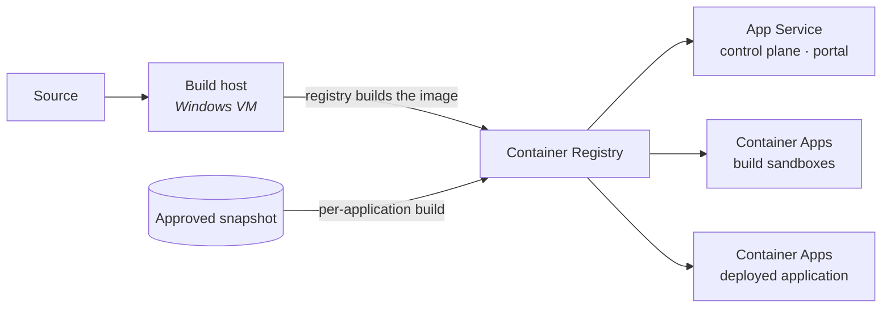

# Deployment

What the platform needs from its host, how an image reaches runtime, and how to tell whether a
deployment actually worked.

This document names Azure services by product name and nothing more. Resource names, hostnames,
subscription identifiers and configuration values are deliberately absent — they differ per
tenant, and a document that restated them would be wrong in a way nobody would notice. Where a
value is needed, the prose names the file that owns it.

## The services, and why each is there

| Service | What the platform uses it for |
|---|---|
| **Container Registry** | Holds the images. It also *builds* them — the control plane asks the registry to build an approved application's image rather than building it itself. |
| **App Service for Containers** | Runs the control plane and the portal edge. Both are long-lived, single-instance services that want a stable address and managed TLS. |
| **Container Apps** | Runs everything disposable: one build sandbox per project, and each deployed application. Created and destroyed constantly and programmatically, which is the job App Service is wrong for. |
| **Database for PostgreSQL** | The platform's own record, and a separate database per project for generated applications. |
| **Cache for Redis** | Build slots, live-session state and background-job scheduling. Nothing durable. |
| **Blob storage** | Workspace snapshots and uploaded files. |

Two divisions are deliberate and worth stating, because they look like duplication.

**Two compute services, not one.** The control plane and portal are stable and want to stay put.
Sandboxes and deployed applications are created on demand, per project, and thrown away. Putting
the disposable workloads on a service designed for programmatic create-and-delete keeps that churn
away from the services people depend on being up.

**The control plane never pushes an image.** It asks the registry to build one and the registry's
own build agent does the pushing. That is why the permission the platform needs on the registry is
read-and-schedule only, with no push or delete — see `reference/` for the role definition and its
reasoning.

## From source to running

Three images are built by an operator from tracked Dockerfiles: the control plane, the portal edge,
and the sandbox image. The fourth thing that runs — a deployed application — is not built from the
repository at all. It is built from the immutable snapshot captured when its author submitted it
for approval, which is what makes an approved application reproducible: the thing deployed is the
thing that was approved, not a rebuild of whatever the workspace looks like now.

The sandbox image is **built and published but never deployed** by an operator. The control plane
creates sandboxes from it at runtime.

### The build host runs Windows, and this constrains the code

Development happens on Linux and macOS. **The image that ships is built on a Windows VM.** That gap
has broken the platform before, and the failures were not obvious ones — they were files that
worked perfectly on the machine they were written on.

The mechanism is line endings. A Windows checkout configured to translate them will rewrite a shell
script's endings on the way out of version control, and a script whose interpreter line ends in a
carriage return fails at container start with an error that names the interpreter as missing rather
than saying anything about line endings. It builds fine. It runs fine locally. It dies in the
container.

Two guards are in place, and both are needed: `.gitattributes` pins the line endings of shell
scripts, Dockerfiles, the shipped configuration and every generated artefact; and the Dockerfile
strips carriage returns from its entrypoint before making it executable, so a checkout that
ignored the first guard still produces a working image.

The registry's build service also drops every file named `.gitignore` from the build context, at
any depth, so none reaches an image. The sandbox's ignore rules therefore live in the
platform-owned exclude file the image installs for every workspace, never in a `.gitignore`.

**Anything that will run on, or ship to, the build host must be written to work there.** Shell
scripts and Dockerfiles in LF, no Unix-only assumptions, OS-agnostic paths, and tooling that works
on Windows. Verifying a change on a Linux or macOS build does not cover the build that actually
ships; when that is the only check that was run, it is worth saying so.

## What has to exist before a production deployment

Some of these are the platform team's to arrange and some are the tenant's. The tenant-side ones
have lead times measured in days, because they need someone with authority the platform does not
have, so they are the ones to start first.

**Needs the tenant, start early:**

- **An application registration in the directory**, with the reply address matching the portal's
  public address exactly. Sign-in fails if these differ by a character.
- **Role assignments for the platform's identity** — permission to ask the registry to build, and
  permission to create and delete container apps in the one resource group that holds them.
  `reference/` carries both role definitions with the scope left unbound; choosing the scope is
  part of the assignment.
- **Permission for the platform's identity to attach a managed identity** to the container apps it
  creates, if generated applications are to read tenant data sources. Without it, container
  creation fails outright for those projects while everything else keeps working — a failure that
  looks like a platform bug and is not.
- **Network reachability to the database server** from the container apps environment, for both
  sandboxes and deployed applications. Each reaches its own database directly; without this their
  data layer is dead while the rest of the platform looks healthy.
- **A DNS name and certificate** for the portal, and for the hostname generated applications are
  served on.

**Platform side:** the database server and its administrative access, the cache, the storage
account, the registry, the container apps environment, and the build host.

### The control plane runs as exactly one instance

This is a binding constraint, not a tuning preference, and nothing enforces it at runtime — a
process cannot see its own siblings. Three things assume it: the pass that reaps abandoned builds
would reap builds running on another instance; the guard that stops one person running two
concurrent builds would stop nothing; and the request-rate ceilings are held per process, so two
instances mean twice the intended limit.

Check it before and after every deployment. Scaling out is possible but is a piece of work, not a
setting: it needs a shared view of liveness and a shared store for the limiters.

## Proving a deployment worked

Work outward, and do not stop at the first green result.

**1. The control plane is up and can reach its dependencies.** The health endpoint reports on the
database and the cache. Read the HTTP status rather than the wording: a cache outage is reported as
degraded *at a successful status code*, because builds cannot start but every other route is fine.
Automation keyed on the word rather than the code will miss it.

**2. The schema is current.** The health check cannot detect a missing migration. Confirm the
database is at the revision this image expects.

**3. The API documentation endpoints are absent.** In production they must not answer. If they do,
the deployment is not running in production mode, and the whole API surface is being served to
anyone who can reach the host.

**4. Sign-in works end to end, in a browser.** Sign in, confirm the session is established, then
leave the tab idle past the access lifetime and confirm the session renews silently. That last
step is what proves the cookie path survives the edge — it is the part that breaks when the edge
is misconfigured, and it cannot be checked with a single request.

**5. A real build runs.** Send a message and watch progress arrive *incrementally*. If it all
lands at once at the end, something in the path is buffering the stream.

**6. The preview renders and responds — measured from inside the container as well as outside.**
This is the check most worth doing properly, because **a green result from outside can sit in front
of a dead container.** A request that never reaches the application can still be answered by
something on the path between you and it. So ask the container about itself: execute a request
inside it against its own port, and compare that with what the public address returns. When inside
is healthy and outside is not, the fault is in the path — ingress, routing, DNS — and not in the
application. When inside is also unhealthy, the application did not start.

Then open it in a real browser and interact with it. A page that returns a successful status can
still have failed to become interactive, and nothing short of using it will tell you.

**7. A deployed application reads and writes its own data**, exercised in a browser. Applications
reach their database directly, so this path is not covered by anything above it.

## When previews load for you but not for the people who need them

A common and confusing failure: builds complete, everything reports healthy, the preview opens
perfectly from the build host — and from an ordinary desk the browser reports that the address
could not be found.

**This is not a firewall rule, an IP restriction or a blocked request.** An address that cannot be
found was never resolved, so nothing was ever blocked. The cause is that the container apps
environment is internal — which is the correct posture — and an internal environment's default
domain has no public DNS. The build host resolves it because of where it sits. A desk does not.

The fix is not to expose the environment. It is to give applications a hostname on the
organisation's own domain and route them through the public entry point that already exists, so
the environment stays internal and the name resolves. Treat "cannot be found" as a naming problem
and "connection refused or timed out" as a network-path problem; they have different fixes and the
symptoms are easy to confuse.

## Where to go next

- `runbooks/` — recovering the cache, the background worker, the reclamation levers, and taking an
  approved application live.
- `architecture.md` — why the pieces are arranged this way.
- `reference/` — the API surface and the permissions the platform requires.
