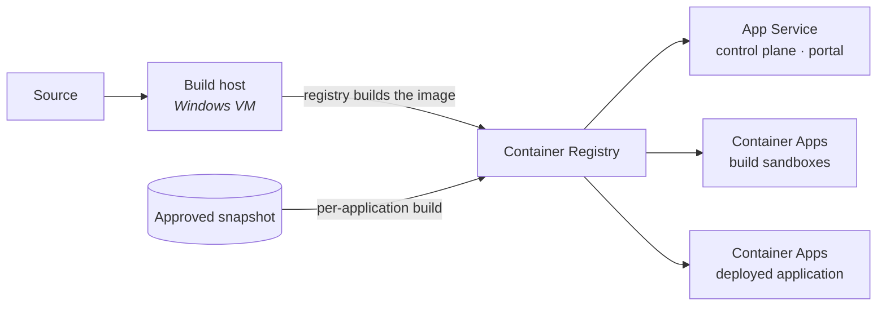

# Deployment

What the platform needs from its host, how an image reaches runtime, and how to tell whether a
deployment actually worked.

This document names Azure services by product name and nothing more. Resource names, hostnames,
subscription identifiers and configuration values are deliberately absent — they differ per
tenant, and a document that restated them would be wrong in a way nobody would notice. Where a
value is needed, the prose names the file that owns it.

## The services, and why each is there

| Service | What the platform uses it for |
|---|---|
| **Container Registry** | Holds the images. It also *builds* them — the control plane asks the registry to build an approved application's image rather than building it itself. |
| **App Service for Containers** | Runs the control plane and the portal edge. Both are long-lived, single-instance services that want a stable address and managed TLS. |
| **Container Apps** | Runs everything disposable: one build sandbox per project, some of them made ahead of time and held ready, and each deployed application. Created and destroyed constantly and programmatically, which is the job App Service is wrong for. |
| **Database for PostgreSQL** | The platform's own record, and a separate database per project for generated applications. |
| **Cache for Redis** | Build slots, live-session state and background-job scheduling. Nothing durable. |
| **Blob storage** | Workspace snapshots and uploaded files. |
| **Container Apps session pool** | Optional. Runs BIAL Chat's file analysis: one Microsoft-managed Python session per chat that holds a spreadsheet, document or deck. Without it, BIAL Chat refuses those files. |

Two divisions are deliberate and worth stating, because they look like duplication.

**Two compute services, not one.** The control plane and portal are stable and want to stay put.
Sandboxes and deployed applications are created on demand, per project, and thrown away. Putting
the disposable workloads on a service designed for programmatic create-and-delete keeps that churn
away from the services people depend on being up.

**The control plane never pushes an image.** It asks the registry to build one and the registry's
own build agent does the pushing. That is why the permission the platform needs on the registry is
read-and-schedule only, with no push or delete — see `reference/` for the role definition and its
reasoning.

## From source to running

```mermaid
flowchart LR
  SRC["Source"] --> BH["Build host<br/><i>Windows VM</i>"]
  BH -->|"registry builds the image"| CR["Container Registry"]
  CR --> AS["App Service<br/>control plane · portal"]
  CR --> SBX["Container Apps<br/>build sandboxes"]
  SNAP[("Approved snapshot")] -->|"per-application build"| CR
  CR --> APP["Container Apps<br/>deployed application"]
```

Three images are built from tracked Dockerfiles: the control plane, the portal edge, and the sandbox
image. `azure-pipelines.yml` releases production from `main` on the build host: it builds them,
waits for an approval, migrates the database, then moves the portal, the control plane and the
worker onto the new images. A release that needs the control plane stopped, or a migration applied
only after the new image serves, is still run by an operator. The fourth thing that runs — a deployed application — is not built from the
repository at all. It is built from the immutable snapshot captured when its author submitted it
for approval, which is what makes an approved application reproducible: the thing deployed is the
thing that was approved, not a rebuild of whatever the workspace looks like now.

The sandbox image is **built and published but never deployed**. The control plane and the worker
create sandboxes from it at runtime, and a release points both at the new image by its immutable tag
(see "The pool of ready sandboxes"). The pipeline names that tag after the content of the sandbox
folder, so a release that leaves the folder unchanged moves nothing.

### The build host runs Windows, and this constrains the code

Development happens on Linux and macOS. **The image that ships is built on a Windows VM.** That gap
has broken the platform before, and the failures were not obvious ones — they were files that
worked perfectly on the machine they were written on.

The mechanism is line endings. A Windows checkout configured to translate them will rewrite a shell
script's endings on the way out of version control, and a script whose interpreter line ends in a
carriage return fails at container start with an error that names the interpreter as missing rather
than saying anything about line endings. It builds fine. It runs fine locally. It dies in the
container.

Two guards are in place, and both are needed: `.gitattributes` pins the line endings of shell
scripts, Dockerfiles, the shipped configuration and every generated artefact; and the Dockerfile
strips carriage returns from its entrypoint before making it executable, so a checkout that
ignored the first guard still produces a working image.

The registry's build service also drops every file named `.gitignore` from the build context, at
any depth, so none reaches an image. The sandbox's ignore rules therefore live in the
platform-owned exclude file the image installs for every workspace, never in a `.gitignore`.

**Anything that will run on, or ship to, the build host must be written to work there.** Shell
scripts and Dockerfiles in LF, no Unix-only assumptions, OS-agnostic paths, and tooling that works
on Windows. Verifying a change on a Linux or macOS build does not cover the build that actually
ships; when that is the only check that was run, it is worth saying so.

## What has to exist before a production deployment

Some of these are the platform team's to arrange and some are the tenant's. The tenant-side ones
have lead times measured in days, because they need someone with authority the platform does not
have, so they are the ones to start first.

**Needs the tenant, start early:**

- **An application registration in the directory**, with a single-page-application reply address
  matching the portal's public address exactly. Sign-in fails if these differ by a character.
- **Role assignments for the platform's identity** — permission to ask the registry to build, and
  permission to create and delete container apps in the one resource group that holds them.
  `reference/` carries both role definitions with the scope left unbound; choosing the scope is
  part of the assignment.
- **Permission for the background worker's identity to create containers**, not only to delete
  them: the container-apps write action, which creates a container with its tags, and the
  environment-join action, on the same resource group. The container apps role definition in
  `reference/` holds both. It is needed before any pool size is raised; see "The pool of ready
  sandboxes" for what its absence looks like.
- **The tenant data source generated applications read, and the managed identity allowed to read
  it.** The control plane refuses to start in production without both: an owner switching the data
  on for a project is the only step between that project and the data, so an unconfigured source
  would leave the switch silently doing nothing.
- **Permission for the platform's identity to attach that managed identity** to the container apps
  it creates. Without it, container creation fails outright for projects that switch the data on
  while everything else keeps working — a failure that looks like a platform bug and is not.
- **Permission for the background worker's identity to attach that managed identity too**, granted
  on that one identity rather than its resource group, before the data-connector pool of ready
  sandboxes is switched on. Without it that pool stays empty and nothing else changes; see "The
  pool of ready sandboxes".
- **Permission for the platform's own identity to read users' basic profiles in the directory.**
  Without it, sharing finds only people who have signed in before, and everything else works. The
  identity caches its tokens, so restart the control plane after the grant.
- **Network reachability to the database server** from the container apps environment, for both
  sandboxes and deployed applications. Each reaches its own database directly; without this their
  data layer is dead while the rest of the platform looks healthy.
- **A DNS name and certificate** for the portal, and for the hostname generated applications are
  served on.
- **For BIAL Chat to open Office and CSV files: a session pool of the Python code-interpreter
  kind**, dedicated to the platform, in the same region, with internet access off, its idle
  cool-down set, and its API-key access switched off. The platform's own identity needs the
  session-executor role on it and nothing else; with the key on, anyone who can read the pool's
  settings can call it. The pool's endpoint is public and has no private path, so the control
  plane must be able to reach it over HTTPS. `backend/.env.example` names the setting, and it stays
  unset until the acceptance check below has passed.

- **For releases through the pipeline:** an agent on the build host, inside the network; an identity
  for the pipeline that can build, read and copy images in the registry, read the control plane's
  settings with their secret values and change them, restart both web apps and read their container
  logs, and update the worker in its container apps environment; and an approval environment,
  created before the first run, because a run that finds none creates one with no approval.

**Platform side:** the database server and its administrative access, the cache, the storage
account, the registry, the container apps environment, and the build host.

**One shared secret, generated per environment.** The portal edge and the control plane carry the
same value: the edge presents it when it asks the control plane which container a preview's address
stands for, and when it hands the control plane a ticket to turn into a preview pass. Each refuses
to start without a well-formed one. A mismatch is not a startup failure — every preview answers
"app not available" — so set both from one source. Rotating it is a restart of both together. The
portal image's Dockerfile and `backend/.env.example` name the input.

The edge also carries the portal's own address, and sends a browser there to collect its preview
pass. It must be exactly the address people sign in at, the one the control plane is configured
with; on any other address the session is absent and no preview opens for anyone.

### The control plane runs as exactly one instance

This is a binding constraint, not a tuning preference, and nothing enforces it at runtime — a
process cannot see its own siblings. Three things assume it: the pass that reaps abandoned builds
would reap builds running on another instance; the guard that stops one person running two
concurrent builds would stop nothing; and the request-rate ceilings are held per process, so two
instances mean twice the intended limit. The record of what each BIAL Chat's analysis session
holds is in process too, but losing it costs only a fresh copy of the chat's files.

Check it before and after every deployment. Scaling out is possible but is a piece of work, not a
setting: it needs a shared view of liveness and a shared store for the limiters.

### The portal and the control plane change together

The edge resolves a preview's address, and who may open it, by asking the control plane, so the two
are deployed as a pair in one quiet window. The order is the portal, then the control plane and the
worker, back to back, and the sandbox image moves with the control plane; it accepts both address
shapes, so it is safe at that point. A newer edge works against an older control plane, which never refuses a preview pass, so
previews stay open to anyone holding a link until the control plane restarts; an older edge against
a newer control plane would show every preview as unavailable. Within one sweep of the worker
starting, previews from before addresses carried an alias are written back and retired, and their
owners get them back, at a new address, on their next start. A rollback takes the control plane
back first, then the portal.

## The pool of ready sandboxes

The platform can hold sandboxes ready ahead of time, so that a start takes one instead of waiting
for the cloud provider to create one (`architecture.md` says why it is shaped as it is, and
`adr/0032-warm-pool-of-ready-sandboxes.md` records the decision). It ships switched off. This
section is what it needs from its host before any size is raised. Setting names are given because
they are the contract with the host; the values an environment runs are not recorded here.

**The worker's identity can create containers.** Pool containers are made by the worker as well as
by the control plane, so the worker's identity needs the container-apps write and environment-join
actions on the one resource group that holds the sandboxes, on top of the read and delete it
already has. Without them nothing breaks for a person: every create the worker makes for the pool
is refused, the pool stays below its size, the worker raises the below-size alarm
(`runbooks/taskiq-worker.md`), and each start that finds nothing ready creates its own sandbox as it
always did.

**The worker needs the portal's address.** Its `FRONTEND_URL` setting is required, holds the same
value as the control plane's, and must be an `https` address in production. A worker without it
does not start.

**Both processes must be told the sandbox image by its immutable tag.** On every sandbox deploy,
set `SANDBOX__IMAGE_REF` to the tag just published, in the control plane and in the worker, in the
same step. The pool learns that an image was deployed only from that setting changing; a moving tag
such as `latest` changes nothing it can see, so ready sandboxes would keep running the old image.
While the two disagree each fills from its own image, which costs at most a few extra creates.

**The settings.** Both processes read each one, and both must hold the same value.

| Setting | Meaning | Default |
|---|---|---|
| `SANDBOX__POOL_DAY_SIZE` | How many ready sandboxes to hold during the day | 0 |
| `SANDBOX__POOL_NIGHT_SIZE` | How many to hold at night | 0 |
| `SANDBOX__POOL_CONNECTOR_DAY_SIZE` | How many ready sandboxes made with the data identity to hold during the day, for data-connector projects | 0 |
| `SANDBOX__POOL_CONNECTOR_NIGHT_SIZE` | How many of those to hold at night | 0 |
| `SANDBOX__POOL_DAY_START` | When the day begins, India time, as `HH:MM` | 09:00 |
| `SANDBOX__POOL_DAY_END` | When the day ends, India time, as `HH:MM`; the day runs up to, not including, it | 19:00 |
| `SANDBOX__POOL_DAY_DAYS` | The days that count as the day, as comma-separated three-letter names | Monday to Friday |

Each size is capped at twenty, and a larger value stops the process from starting, so a mistyped
size fails the deploy instead of quietly running dozens of containers; so does a day that ends
before it begins. `backend/src/services/sandbox/config.py` owns these settings. A size of zero means
no ready sandboxes in that period, and every size is 0 by default.

**Capacity comes first.** Each ready sandbox takes addresses and cores in the container apps
environment on top of the live ones, and an image swap briefly needs twice as many. Confirm the
environment's limits cover twice the largest plain size and twice the largest connector size,
together, plus the peak number of live sandboxes before raising a size. There is no combined cap.

**A data-connector project takes a ready sandbox only from a pool of its own.** It reads tenant data
through an identity that is attached when its container is created, so a plain ready sandbox
cannot serve it. The connector pool's sandboxes are created with that identity and nothing of any
project's. Filling it needs two things the plain pool does not: the worker's identity may attach
the data identity (see "What has to exist before a production deployment"), and the worker holds
the same
`CONNECTOR_LAKE__*` settings as the control plane. Without either, nothing breaks for a person: each
connector fill is refused with a warning, the worker raises that pool's below-size alarm, and a
data-connector project's start creates its own sandbox as it always did. Once the missing piece is
in place the next pass fills, with no restart.

**Switching the connector pool on**, once both processes run the release that brought it:

1. Confirm the worker's grant to attach the data identity, and the control plane's, reading the
   scope of each as well as that it exists.
2. Set `CONNECTOR_LAKE__*` on the worker to the control plane's values.
3. Set both connector sizes on the control plane, then on the worker.
4. Watch that pool's line in the worker's log until it reaches its size, then prove it with step 9
   below.

**The control plane's connector sizes are what keep an older release away.** An older release
refuses to start while either `SANDBOX__POOL_CONNECTOR_*` setting is present, which matters because
an older control plane would hand a ready sandbox carrying the data identity to any project. So the
settings go on the control plane, at zero or above, before any worker size rises above zero; a
drain sets them to zero rather than removing them; and they come off only as the last step of a
rollback, in `runbooks/reconcile-and-reclamation.md`.

**The release that introduced this is deployed in one order.** It changed how every workspace is
named and found, and an older backend or worker meeting the newer one's records loses citizens'
work. Deploy it outside working hours, with the scheduled sweep on and nobody calling the manual
reap: run the migrations, stop the old backend, deploy the worker and wait until only its new
revision is running, then start the new backend. `runbooks/reconcile-and-reclamation.md` records
what goes wrong in any other order.

**The platform cannot be rolled back past that release.** Once a sandbox has been created under a
random name, an older build would delete it without saving. A forced rollback first drains the
pool, saves and ends every live workspace through the new code, and waits until no deletion is
owed; the procedure is in `runbooks/reconcile-and-reclamation.md`.

## Proving a deployment worked

Work outward, and do not stop at the first green result.

The release pipeline proves less than this list. It confirms the migration reached the head, that
each web app started on the new image and answers, and that the worker runs one healthy revision of
it. Everything from check 3 on is still done by a person afterwards. When a run fails, its log
names the step that stopped it; the rollback commands are printed near its start, and after a
failed attempt the first attempt's are the ones that restore the old images.

**1. The control plane is up and can reach its dependencies.** The health endpoint answers `ok`
when the database and the cache both respond, and `unavailable` with a 503 when either does not.
It does not say which one; the control plane's log names the failed dependency. Ask it on the
control plane's own address: the portal does not route it, and answers that the route does not
exist.

**2. The schema is current.** The health check cannot detect a missing migration. Confirm the
database is at the revision this image expects.

**3. The API documentation endpoints are absent.** In production they must not answer. If they do,
the deployment is not running in production mode, and the whole API surface is being served to
anyone who can reach the host.

**4. Sign-in works end to end, in a browser.** Sign in, confirm the session is established, then
leave the tab idle past the access lifetime and confirm the session renews silently. That last
step is what proves the cookie path survives the edge — it is the part that breaks when the edge
is misconfigured, and it cannot be checked with a single request.

**5. A real build runs.** Send a message and watch progress arrive *incrementally*. If it all
lands at once at the end, something in the path is buffering the stream.

**6. The preview renders and responds — measured from inside the container as well as outside.**
This is the check most worth doing properly, because **a green result from outside can sit in front
of a dead container.** A request that never reaches the application can still be answered by
something on the path between you and it. So ask the container about itself: execute a request
inside it against its own port, and compare that with what the public address returns in the
owner's signed-in browser; any other request to a live preview is sent to the portal instead. When inside
is healthy and outside is not, the fault is in the path — ingress, routing, DNS — and not in the
application. When inside is also unhealthy, the application did not start.

Then open it in a real browser and interact with it. A page that returns a successful status can
still have failed to become interactive, and nothing short of using it will tell you.

More checks cover the edge's address lookup: a new preview opens at its own address, inside the
workspace and in a new tab; the same address in a private window goes to the portal's sign-in, not
the preview, and another signed-in person gets the "app not available" page; a made-up address, and
a container's own name in place of the address, both show that page; and a deployed application
still opens, signed in or not.

**7. A deployed application reads and writes its own data**, exercised in a browser. Applications
reach their database directly, so this path is not covered by anything above it.

**8. Every kind of start is recorded once.** Open a saved project, send the first message of a new
project, send a chat message after the workspace has gone, switch to another project, and open a
shared application as a colleague. The superadmin report of sandbox starts (see `reference/`) shows
a count for each kind, and each of those starts is one record: its stage times add up to within a
second of its total, and the browser's click-to-visible time is attached once the app showed.
Attaching to a workspace that is already running writes none. A kind that shows nothing is a path
that never opens its record, which no other check here would find.

**9. The pool, once a size is above zero.** Within a few minutes the ready sandboxes number the
configured size, and the worker's per-minute pass logs one line for each pool each tick. A start
made then appears in the report as having claimed a ready sandbox, its create stage shrunk to the
time of the claim; a start made with none ready in its own pool appears with the reason it created
one. Once the connector pool is on, open one data-connector project: its start appears as having
claimed, and its application still reads the data a minute later, once the claim has rewritten the
sandbox's tags. If it cannot, set the connector sizes back to zero.
Through a working day that includes a sandbox image deploy, the below-size alarm is quiet, or the
worker's log explains each one by a refused create, a new sandbox that never answered, or a create a
restart interrupted.

**10. BIAL Chat's analysis sessions cannot reach anything, before they are switched on.** As an
identity holding the session-executor role, run code in a session of the pool that tries a public
address, a name lookup, a private address and the instance-metadata address. Every attempt must
fail. Record the result, and only then set the pool's endpoint for the control plane. Then, in a
browser, attach a workbook to a BIAL Chat, ask for a total, and watch the analysis steps appear
and the answer arrive; ask a follow-up; delete the chat, and confirm the pool no longer lists its
session.

## When previews load for you but not for the people who need them

A common and confusing failure: builds complete, everything reports healthy, the preview opens
perfectly from the build host — and from an ordinary desk the browser reports that the address
could not be found.

**This is not a firewall rule, an IP restriction or a blocked request.** An address that cannot be
found was never resolved, so nothing was ever blocked. The cause is that the container apps
environment is internal — which is the correct posture — and an internal environment's default
domain has no public DNS. The build host resolves it because of where it sits. A desk does not.

The fix is not to expose the environment. It is to give applications a hostname on the
organisation's own domain and route them through the public entry point that already exists, so
the environment stays internal and the name resolves. Treat "cannot be found" as a naming problem
and "connection refused or timed out" as a network-path problem; they have different fixes and the
symptoms are easy to confuse.

## Where to go next

- `runbooks/` — recovering the cache, the background worker, and reconciling the sandbox fleet.
- `architecture.md` — why the pieces are arranged this way.
- `reference/` — the API surface and the permissions the platform requires.
